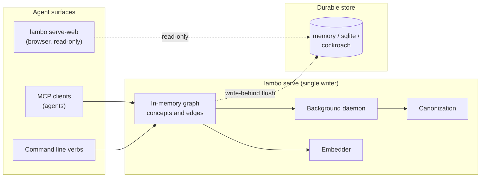

# Lambo

Agentic graph memory for multi-agent coding. Lambo stores what your agents learn and recalls
it by meaning. A background process promotes concepts to canonical facts when they earn it
from structural evidence, not when an agent declares them important.

### [Read the documentation at nrynss.github.io/lambo](https://nrynss.github.io/lambo)

[Quickstart](https://nrynss.github.io/lambo/quickstart/) ·
[Demo](https://nrynss.github.io/lambo/demo/) ·
[Installation](https://nrynss.github.io/lambo/installation/) ·
[MCP tools](https://nrynss.github.io/lambo/mcp/) ·
[Command line](https://nrynss.github.io/lambo/cli/) ·
[Configuration](https://nrynss.github.io/lambo/config/) ·
[Library API](https://nrynss.github.io/lambo/api/) ·
[End to end](https://nrynss.github.io/lambo/end-to-end/)

Everything below is covered there in depth.

## Deployment model

One `lambo serve` process owns a session and is its **single writer**. Agents connect over
MCP, by stdio or HTTP, and share that process's in-memory graph. Mutations flush
asynchronously to the durable store.

Any number of readers query the store directly and see eventually consistent state.
Dashboards and the CockroachDB managed MCP server work this way. Readers never write.
Multi-writer coordination stays out of scope for v0.1.

Real agents drive this. Claude Code connects over stdio and lists all seven tools, and a
DeepSeek Flash model running under OMP autonomously called derive, recall, and stats
against a live CockroachDB session.

## Install and run

Lambo ships as one binary carrying every adapter. You install it, then write a `lambo.toml`
that picks a store and an embedder at runtime.

```bash
curl -fsSL https://github.com/nrynss/lambo/releases/latest/download/install.sh | sh
```

The script verifies a SHA-256 checksum and installs to `~/.local/bin`. Windows binaries sit
on the [releases page](https://github.com/nrynss/lambo/releases).

See the memory layer work before you configure anything. This needs no config file, runs
against the in-memory store, and finishes in seconds.

```bash
lambo demo
```

Two agents build one REST API. `user schema` earns canonical status from the real
canonization engine, and the second agent's recall warns that it is load-bearing and was
just edited. The [Demo page](https://nrynss.github.io/lambo/demo/) explains what the run
proves and what it compresses.

To run it for real, write a `lambo.toml` that picks a store and an embedder.

```toml
# lambo.toml
[store]
kind = "memory"     # memory | sqlite | cockroach

[embedder]
kind = "fixture"    # fixture | bge_m3
dim = 1024
```

```bash
lambo serve --config lambo.toml --session demo --agent agent-a
```

Switching to a durable store means editing that file, not downloading a different build. See
[Quickstart](https://nrynss.github.io/lambo/quickstart/) for the 30 second version and
[Installation](https://nrynss.github.io/lambo/installation/) for MCP client setup, real
embeddings, and building from source.

## Pluggable backends

Cargo features decide which adapters get compiled in. `lambo.toml` decides which one runs.
Environment variables override the file, so a cluster DSN stays out of it. Copy
[`lambo.example.toml`](lambo.example.toml) to start, and see
[Configuration](https://nrynss.github.io/lambo/config/) for every key and override.

Released binaries carry the full adapter set, so picking a backend is a config decision
rather than a build decision. Building your own with a narrower feature list is covered in
[Installation](https://nrynss.github.io/lambo/installation/). The design of record is
[`dev-diary/notes/level-b-pluggability.md`](dev-diary/notes/level-b-pluggability.md).

**Do not switch embedder models mid-session without re-embedding.** Vectors from different
models are not comparable. Session identity is the `EmbeddingContract` of kind, model, and
dimension.

## Architecture



## Reference

| Page | What it covers |
|---|---|
| [MCP tools](https://nrynss.github.io/lambo/mcp/) | The seven tools agents call, with arguments and limits |
| [Command line](https://nrynss.github.io/lambo/cli/) | The same operations as deterministic one-shot lines |
| [Configuration](https://nrynss.github.io/lambo/config/) | Every `lambo.toml` key, env override, and feature flag |
| [Library API](https://nrynss.github.io/lambo/api/) | The Rust `Memory` API and the adapter traits |
| [End to end](https://nrynss.github.io/lambo/end-to-end/) | Serving, reading, and running a swarm against one session |
| [Demo](https://nrynss.github.io/lambo/demo/) | Two agents building one REST API on shared memory |

## CockroachDB tools used

| Tool | How Lambo uses it |
|---|---|
| **Distributed vector indexing** | `concepts.embedding VECTOR(1024)` with a vector index, powering semantic concept merging. The vectors live beside the graph they describe rather than in a separate retrieval sidecar. |
| **Cloud managed MCP server** | Connected read-only to inspect a live session from an agent client. Querying `canonization_events` shows concepts earning status, and `edges` traces provenance. |
| **ccloud CLI** | Cluster creation and DSN capture, following [`dev-diary/notes/spike-runbook.md`](dev-diary/notes/spike-runbook.md). [`scripts/provision.sh`](scripts/provision.sh) then applies the schema idempotently. |

## AWS services used

None yet. Lambo v0.1 runs entirely on CockroachDB plus a local embedder, and no released
build calls an AWS API.

The `Embedder` trait was designed so Amazon Titan Text Embeddings V2 on Bedrock can drop in
as the dense path, and `embed-bedrock` is reserved as a Cargo feature. The adapter behind
that feature is not implemented, so selecting `kind = "bedrock"` fails at startup with that
message. BGE-M3 served by a local `llama-server` is the only real embedder today.

## Development

Phase by phase handoffs, adversarial reviews, and evidence live in [`dev-diary/`](dev-diary/).
Run `cargo test` for the suite. The docs site source sits in [`site/`](site/) and deploys to
GitHub Pages from `main`.

## License and credit

Apache License 2.0. See [LICENSE](LICENSE) and [NOTICE](NOTICE).

Lambo was written during the hackathon submission period. It draws on a prior design
document by the same author, credited here for honesty. No code from that document was
incorporated.
