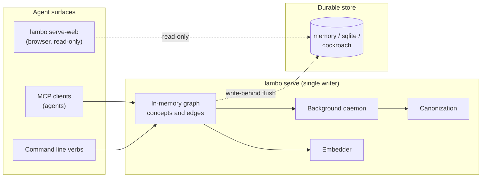

# Lambo

Agentic graph memory for multi-agent coding. Lambo stores what your agents learn and recalls
it by meaning. A background process promotes concepts to canonical facts when they earn it
from structural evidence, not when an agent declares them important.

### [Read the documentation at nrynss.github.io/lambo](https://nrynss.github.io/lambo)

[Quickstart](https://nrynss.github.io/lambo/quickstart/) ·
[Demo](https://nrynss.github.io/lambo/demo/) ·
[Installation](https://nrynss.github.io/lambo/installation/) ·
[MCP tools](https://nrynss.github.io/lambo/mcp/) ·
[Command line](https://nrynss.github.io/lambo/cli/) ·
[Configuration](https://nrynss.github.io/lambo/config/) ·
[Library API](https://nrynss.github.io/lambo/api/) ·
[End to end](https://nrynss.github.io/lambo/end-to-end/)

Everything below is covered there in depth.

## Deployment model

One `lambo serve` process owns a session and is its **single writer**. Agents connect over
MCP, by stdio or HTTP, and share that process's in-memory graph. Mutations flush
asynchronously to the durable store.

Any number of readers query the store directly and see eventually consistent state.
Dashboards and the CockroachDB managed MCP server work this way. Readers never write.
Multi-writer coordination stays out of scope for v0.2.

Real agents drive this. Claude Code and the Cursor Agent CLI each connect over stdio and
list all seven tools, and two different models have driven the tools autonomously: DeepSeek
Flash under OMP called derive, recall, and stats against a live CockroachDB session, and
Cursor's model ran derive, record_action, recall, and stats in sequence. Transcripts are in
[`evidence/`](evidence/).

## The agent skill

[`skills/lambo-cloudops/`](skills/lambo-cloudops/SKILL.md) is the protocol written for
agents to read: recall before you touch shared state, treat a blocking warning as
blocking, record what you built so the next agent inherits it. Any tool-using agent can
load it, and the docs mirror it at
[agent skill](https://nrynss.github.io/lambo/agent-skill/).

The surface is small enough that a very small model can execute the protocol against it.
Given that skill and Lambo's four MCP tools, **Qwen3-0.6B**, a 0.6-billion-parameter
model running locally under llama.cpp, drove the MCP surface directly: three agents
against one session for 151 seconds, 55 tasks, 173 tool calls, 165 of them successful.

- **In every task where the model acted, it called recall before it wrote anything**
  (43 of 43), and **none of its 45 derive calls happened without a prior recall in the
  same task.**
- Every call was one the model composed itself, and the surface refused none of them for
  malformed arguments: 86 recalls, 45 derives, 40 record_actions, 2 inspects. The eight
  failures were transport, not rejection.
- 0.857 of successful derives landed on concepts that already existed, so the graph
  converged instead of sprawling.
- On SIGTERM after the run, the store matched the ledger exactly: 82 interactions, 12
  concepts, nothing lost.

The tasks in that run named the sequence to follow, so this measures whether a very small
model can execute the protocol reliably against a live surface, not whether it reaches
for memory unprompted. Ledger, transcripts, and the post-SIGTERM durability readback are
in [`evidence/swarm/`](evidence/swarm/).

## Install and run

Lambo ships as one binary carrying every adapter. You install it, then write a `lambo.toml`
that picks a store and an embedder at runtime.

```bash
curl -fsSL https://github.com/nrynss/lambo/releases/latest/download/install.sh | sh
```

The script verifies a SHA-256 checksum and installs to `~/.local/bin`. Windows binaries sit
on the [releases page](https://github.com/nrynss/lambo/releases).

`cargo install lambo` is a leaner channel: it builds the crate's default
features (`memory` store, `fixture` and `bge_m3` embedders). The prebuilt
binaries above carry the full adapter set (`ship` profile); build from source
with `cargo build --release --features ship` for the same.

See the memory layer work before you configure anything. This needs no config file, runs
against the in-memory store, and finishes in seconds.

```bash
lambo demo
```

Two agents build one REST API. `user schema` earns canonical status from the real
canonization engine, and the second agent's recall warns that it is load-bearing and was
just edited. The [Demo page](https://nrynss.github.io/lambo/demo/) explains what the run
proves and what it compresses.

To run it for real, write a `lambo.toml` that picks a store and an embedder.

```toml
# lambo.toml
[store]
kind = "memory"     # memory | sqlite | cockroach

[embedder]
kind = "fixture"    # fixture | bge_m3
dim = 1024
```

```bash
lambo serve --config lambo.toml --session demo --agent agent-a
```

Switching to a durable store means editing that file, not downloading a different build. See
[Quickstart](https://nrynss.github.io/lambo/quickstart/) for the 30 second version and
[Installation](https://nrynss.github.io/lambo/installation/) for MCP client setup, real
embeddings, and building from source.

## Pluggable backends

Cargo features decide which adapters get compiled in. `lambo.toml` decides which one runs.
Environment variables override the file, so a cluster DSN stays out of it. Copy
[`lambo.example.toml`](lambo.example.toml) to start, and see
[Configuration](https://nrynss.github.io/lambo/config/) for every key and override.

Released binaries carry the full adapter set, so picking a backend is a config decision
rather than a build decision. Building your own with a narrower feature list is covered in
[Installation](https://nrynss.github.io/lambo/installation/). The design of record is
[`dev-diary/notes/level-b-pluggability.md`](dev-diary/notes/level-b-pluggability.md).

**Do not switch embedder models mid-session without re-embedding.** Vectors from different
models are not comparable. Session identity is the `EmbeddingContract` of kind, model, and
dimension.

## Architecture



## Reference

| Page | What it covers |
|---|---|
| [MCP tools](https://nrynss.github.io/lambo/mcp/) | The seven tools agents call, with arguments and limits |
| [Command line](https://nrynss.github.io/lambo/cli/) | The same operations as deterministic one-shot lines |
| [Configuration](https://nrynss.github.io/lambo/config/) | Every `lambo.toml` key, env override, and feature flag |
| [Library API](https://nrynss.github.io/lambo/api/) | The Rust `Memory` API and the adapter traits |
| [End to end](https://nrynss.github.io/lambo/end-to-end/) | Serving, reading, and running a swarm against one session |
| [Demo](https://nrynss.github.io/lambo/demo/) | Two agents building one REST API on shared memory |

## CockroachDB tools used

| Tool | How Lambo uses it |
|---|---|
| **Distributed vector indexing** | `concepts.embedding VECTOR(1024)` with a vector index, powering semantic concept merging. The vectors live beside the graph they describe rather than in a separate retrieval sidecar. |
| **Cloud managed MCP server** | Connected read-only to inspect a live session from an agent client. Querying `canonization_events` shows concepts earning status, and `edges` traces provenance. Captured: `select_query` returned the five-event status walk for a demo session, with `user schema` going Candidate to Venerable to Canonical at blast radius 9 ([transcript](evidence/managed-mcp-canonization-events.md)). Three MCP clients have now driven that server model-first — OMP, Claude Code, and the Cursor Agent CLI — returning the same rows and agreeing on every field ([transcripts](evidence/mcp-client-interop/)). |
| **ccloud CLI** | Cluster creation and DSN capture, following [`dev-diary/notes/spike-runbook.md`](dev-diary/notes/spike-runbook.md). [`scripts/provision.sh`](scripts/provision.sh) then applies the schema idempotently. |

## AWS services used

The point is not that this touches six services. It is that two autonomous agents
provisioned real AWS infrastructure, one of them moved to delete a shared security group
the other agent's database was sitting behind, and Lambo stopped it, because the
dependency was recorded structure, not a similar-looking sentence in a vector store. That
failure mode is a production outage flat memory cannot see coming. The table is supporting
detail.

The live portal reading that session is at **[lambo.nryn.dev](https://lambo.nryn.dev)**,
read-only and test-enforced. Every service below is exercised by it; none is aspirational.

| Service | How this project uses it |
|---|---|
| **Amazon EC2** | Hosts the public portal: `lambo serve-web` bound to loopback behind Caddy on an `m7i-flex.large` running Ubuntu 26.04, with an Elastic IP so the A record survives a stop/start, and IMDSv2 required. |
| **Amazon VPC** | Subnets, route tables, internet gateway and security groups: the network the two agents provisioned and that Lambo tracks as graph nodes. The shared security group and the private subnet are the load-bearing pillars whose blast radius the demo protects. No NAT gateway anywhere, by design. |
| **AWS Secrets Manager** | Holds the CockroachDB DSN. A wrapper resolves it at service start and `exec`s `lambo`, so the value exists only in the running process's environment: no `EnvironmentFile`, nothing in user data, nothing in an AMI or a snapshot. |
| **AWS Lambda** | A public read-only stats endpoint over the live session, `python3.12` on arm64 behind a Function URL, deliberately outside the VPC because it reads an internet-facing database and has no reason to reach RDS. |
| **Amazon RDS for PostgreSQL** | The private-tier workload the app-data agent provisioned: `db.t4g.micro`, encrypted, not publicly accessible. Its dependency on the shared security group and private subnet is precisely what the blast-radius warning protects. It is **not** a Lambo store: `VECTOR(1024)` and `CREATE VECTOR INDEX` do not apply to stock PostgreSQL. |
| **AWS IAM** | An instance profile and a Lambda execution role, each scoped to the single secret ARN it needs rather than to `secretsmanager:*`. |

One honest boundary: AWS runs *around* Lambo here, not inside it. The released binary
calls no AWS API. Amazon Titan Text Embeddings V2 is wired as `embed-bedrock` (issue
#3): the adapter constructs, the session contract names `amazon.titan-embed-text-v2:0`,
and `embed` fail-closes until the account is AUTHORIZED. BGE-M3 served by a local
`llama-server` is the live dense path today
([capture](evidence/bedrock-blocked.txt)).

## Development

Raw captures behind every claim live in [`evidence/`](evidence/), indexed by its
[README](evidence/README.md). Phase by phase handoffs and adversarial reviews live in
[`dev-diary/`](dev-diary/).
Run `cargo test` for the suite. The docs site source sits in [`site/`](site/) and deploys to
GitHub Pages from `main`.

## License and credit

Apache License 2.0. See [LICENSE](LICENSE) and [NOTICE](NOTICE).

Lambo implements a design its author worked out over months. The implementation in this
repository was written during a hackathon, which supplied the deadline rather than the
idea. No code from the prior design document was incorporated — it described behaviour,
not implementation — and it is credited here for honesty rather than because anything was
lifted from it. [Origin](https://nrynss.github.io/lambo/origin/) has the longer version.
